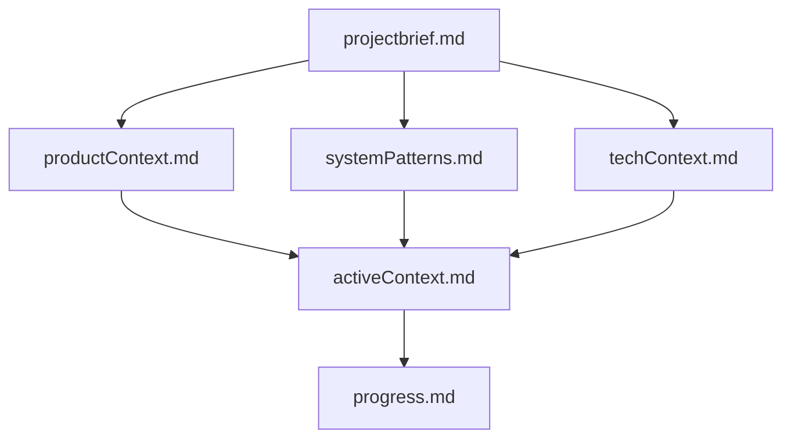

# Memory Bank

## Purpose

The Memory Bank is a structured documentation system that maintains complete project context across AI agent sessions. Since AI agents have no memory persistence between sessions, this documentation is **critical** for continuity and effectiveness.

## Why Memory Bank?

AI coding agents like GitHub Copilot reset their memory completely between sessions. Without the Memory Bank:

- ❌ No understanding of project architecture
- ❌ No awareness of previous decisions
- ❌ No context about design patterns
- ❌ Must rediscover everything each time

With the Memory Bank:

- ✅ Instant project context loading
- ✅ Decision history preserved
- ✅ Design patterns documented
- ✅ Seamless continuation of work

## File Structure

The Memory Bank follows a hierarchical structure where files build upon each other:

## Core Files

### Foundation Layer

#### `projectbrief.md`

**Purpose**: The foundation document that shapes all other files

**Contents**:

- Project overview and objectives
- Core scope (in/out of scope)
- Success criteria
- Deliverables
- Timeline phases
- Stakeholders
- Constraints and risks

**When to Read**: Start of every AI session

**When to Update**: When project scope or objectives change

---

#### `productContext.md`

**Purpose**: Why this project exists and how it should work

**Contents**:

- Problem statement
- Solution approach
- User workflows
- Use cases
- Expected behaviors
- User experience goals

**When to Read**: When implementing user-facing features

**When to Update**: When understanding of user needs evolves

---

#### `systemPatterns.md`

**Purpose**: Technical architecture and design decisions

**Contents**:

- System architecture
- Key technical decisions
- Design patterns in use
- Component relationships
- Critical implementation paths
- Technology choices and rationale

**When to Read**: When making architectural decisions or implementing features

**When to Update**: When significant technical decisions are made

---

#### `setupGuide.md`

**Purpose**: Comprehensive machine setup and installation instructions

**Contents**:

- System prerequisites and requirements
- Tool installation steps (Chocolatey, PowerShell, Git, VS Code)
- PowerShell module installation
- Environment configuration
- Windows Defender configuration (optional)
- Troubleshooting common issues
- Maintenance and cleanup procedures

**When to Read**: When setting up a new development/analysis machine

**When to Update**: When installation procedures or prerequisites change

---

#### `techContext.md`

**Purpose**: Technologies, tools, and development setup

**Contents**:

- Technology stack
- Development environment
- Dependencies and versions
- Tool usage patterns
- Technical constraints
- Setup instructions

**When to Read**: When setting up development environment or adding dependencies

**When to Update**: When technologies or tools change

---

### Active Work Layer

#### `activeContext.md`

**Purpose**: Current work focus and recent changes

**Contents**:

- Current work focus
- Latest activity log
- Recent changes
- Active decisions and considerations
- Important patterns discovered
- Learnings and insights

**When to Read**: **MANDATORY at start of every AI session**

**When to Update**: **After every significant work session** (daily/per-session minimum)

---

#### `progress.md`

**Purpose**: What works, what's left, and current status

**Contents**:

- Current status and phase
- Completed items (✅)
- Pending items (⏳)
- Known issues
- Metrics and statistics
- Timeline

**When to Read**: When planning next steps or reporting status

**When to Update**: As work items are completed

---

### Historical Record

#### `promptHistory.md`

**Purpose**: Complete record of all AI interactions

**Contents**:

- Date/time of each interaction
- User request
- Actions taken
- Files modified
- Impact assessment
- Decisions made

**When to Read**: When understanding how the project evolved

**When to Update**: **After every AI agent interaction** (automatic/mandatory)

---

## Usage Guidelines

### For AI Agents

**At Session Start** (MANDATORY):

1. Read `projectbrief.md` - Understand the project
2. Read `activeContext.md` - Understand current state
3. Read `progress.md` - Understand what's done and what's next

**During Work**:

- Reference `systemPatterns.md` for technical decisions
- Reference `techContext.md` for technology details
- Reference `productContext.md` for user requirements

**At Session End** (MANDATORY):

1. Update `activeContext.md` with latest changes
2. Update `progress.md` with completed items
3. Update `promptHistory.md` with session summary

**When User Says "update memory bank"**:

- Review **ALL** files (not just those needing updates)
- Update any files that are outdated
- Focus especially on `activeContext.md` and `progress.md`

### For Human Developers

**Starting Work**:

- Read `activeContext.md` to see where AI left off
- Check `progress.md` for pending tasks

**Planning Changes**:

- Review `systemPatterns.md` for architectural constraints
- Check `techContext.md` for technology guidelines

**Documenting Work**:

- Update `activeContext.md` with your changes
- Add entry to `promptHistory.md` if desired

## File Maintenance

### Update Frequency

| File | Update Frequency |
|------|------------------|
| `projectbrief.md` | Rarely (major scope changes only) |
| `productContext.md` | Occasionally (when product vision evolves) |
| `systemPatterns.md` | Occasionally (when architecture decisions made) |
| `techContext.md` | Occasionally (when tech stack changes) |
| `activeContext.md` | **Every session** |
| `progress.md` | **Frequently** (as work completes) |
| `promptHistory.md` | **Every AI interaction** |

### Quality Standards

- ✅ **Complete**: All sections filled out
- ✅ **Current**: Information is up-to-date
- ✅ **Accurate**: Facts are verified
- ✅ **Clear**: Written for understanding
- ✅ **Structured**: Follows template format

### Signs of Good Memory Bank

- AI agent can resume work immediately
- No repetitive questions about architecture
- Consistent design decisions
- Clear understanding of "why" behind choices
- Smooth handoff between sessions

### Signs of Poor Memory Bank

- AI asks same questions repeatedly
- Inconsistent implementation approaches
- Lost context from previous sessions
- Unclear decision rationale
- Frequent confusion about project goals

## Template Structure

Each core file follows a template structure to ensure consistency. See individual files for examples.

## Best Practices

### DO

- ✅ Update `activeContext.md` after every session
- ✅ Keep `progress.md` current with completed work
- ✅ Document significant decisions in `systemPatterns.md`
- ✅ Record all AI interactions in `promptHistory.md`
- ✅ Write clearly and concisely
- ✅ Use consistent formatting

### DON'T

- ❌ Skip memory bank updates
- ❌ Leave outdated information
- ❌ Write vague or unclear descriptions
- ❌ Duplicate information across files
- ❌ Assume AI remembers previous sessions

## Related Documentation

- [Project Brief](projectbrief.md) - Start here for project overview
- [Active Context](activeContext.md) - Current work state
- [Progress](progress.md) - Status and pending work
- [Prompt History](promptHistory.md) - Complete interaction history

---

**Remember**: The Memory Bank is not optional documentation. It is the **essential foundation** that enables AI agents to work effectively on this project.
