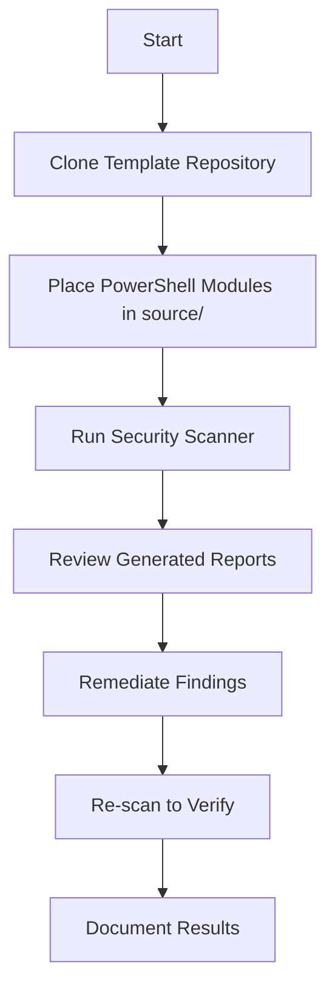

# Product Context: PowerShell Security Code Review Template

## Why This Project Exists

PowerShell is a powerful scripting language widely used for system administration, automation, and DevOps operations. However, its power comes with security risks:

- **Code Execution Vulnerabilities**: Dangerous cmdlets like `Invoke-Expression` can execute arbitrary code
- **Credential Exposure**: Improper handling of credentials can lead to security breaches
- **Injection Attacks**: Script injection, command injection, and SQL injection vulnerabilities
- **Obfuscation Techniques**: Malicious actors use obfuscation to hide malicious intent
- **Supply Chain Risks**: Third-party modules may contain malicious or vulnerable code

This project provides a reusable template and framework for **AI-assisted automated security assessment** of any PowerShell modules. The primary design goal is enabling AI coding agents (like GitHub Copilot, Cline, or similar) to perform comprehensive security code reviews systematically, with minimal human guidance. Organizations can leverage this template to identify and remediate security risks efficiently through AI-powered analysis.

## Problems It Solves

### 1. Manual Security Review Inefficiency

**Problem**: Manual code review is time-consuming and error-prone
**Solution**: Automated scanning with comprehensive rule sets and PSScriptAnalyzer integration

### 2. Inconsistent Security Standards

**Problem**: Different reviewers apply different security criteria
**Solution**: Standardized detection rules with clear severity classifications and CVSS scoring

### 3. Hidden Vulnerabilities

**Problem**: Security issues are not always obvious to reviewers
**Solution**: Pattern-based detection for common vulnerability types and malicious code patterns

### 4. Lack of Remediation Guidance

**Problem**: Developers don't know how to fix identified issues
**Solution**: Each finding includes specific remediation recommendations

### 5. Compliance Requirements

**Problem**: Organizations need documented security assessments
**Solution**: Comprehensive reports with executive summaries and detailed findings

## How It Should Work

### User Experience Flow

### Key Workflows

#### 1. Template Setup Workflow

- Clone this repository to your workspace
- Review Memory Bank documentation to understand the framework
- Verify scanning scripts and detection rules are present
- Customize rules if needed for your organization

#### 2. Module Analysis Workflow

- Place PowerShell modules to analyze in the `source/` directory
- Run `Invoke-SecurityScan.ps1` against your modules
- Review detection rule applications with context awareness
- Examine filtered results (false positives automatically reduced)

#### 3. Reporting Workflow

- Generate executive summary across all scanned modules
- Create detailed per-module security reports
- Review findings with code context and line numbers
- Access remediation guidance for each identified issue

#### 4. Remediation Workflow

- Share reports with development teams
- Implement suggested remediations
- Re-scan modules to verify fixes
- Document security improvements

## User Experience Goals

### For Security Auditors

- **Clear Overview**: Executive summary provides high-level security posture
- **Detailed Analysis**: Per-module reports enable deep investigation
- **Risk Assessment**: CVSS scores enable risk prioritization
- **Audit Trail**: Complete documentation of methodology and findings

### For Developers

- **Actionable Feedback**: Clear remediation guidance for each finding
- **Context Awareness**: Rules understand PowerShell-specific patterns
- **Low False Positives**: Intelligent filtering reduces noise
- **Learning Opportunity**: Findings educate on secure coding practices

### For Compliance Teams

- **Documentation**: Comprehensive reports for compliance requirements
- **Standardization**: Consistent security criteria across all modules
- **Traceability**: Each finding linked to specific rules and standards
- **Metrics**: Quantifiable security metrics (CVSS scores, finding counts)

## Key Features

### 1. Comprehensive Rule Set

- Code execution vulnerabilities (Invoke-Expression, scriptblocks)
- Credential handling issues (hardcoded secrets, logging)
- Injection vulnerabilities (command, SQL, script)
- Obfuscation detection (character substitution, encoding)
- Dangerous API usage (unrestricted deserialization)

### 2. Context-Aware Analysis

- PowerShell-specific understanding (scriptblock legitimacy)
- Credential handling conventions (semi-secure patterns)
- Configuration context (hostname checks in config code)
- String escaping patterns (legitimate character usage)

### 3. Integration with PSScriptAnalyzer

- Leverage built-in security rules
- Custom rule extensions
- Community rule incorporation (DSC Community)

### 4. Automated Scanning

- Batch processing of all modules
- Consistent analysis across codebase
- Repeatable security assessments

### 5. Rich Reporting

- Executive summaries for management
- Detailed technical reports for developers
- CVSS scoring for risk prioritization
- Remediation guidance for fixes

## Expected Outcomes

### For Organizations Using This Template

#### Immediate Outcomes

- Complete security assessment of PowerShell modules
- Identified vulnerabilities with severity classifications
- Actionable remediation plans for development teams
- Compliance-ready documentation

#### Long-term Benefits

- Improved security posture of PowerShell codebase
- Reduced risk of security incidents
- Enhanced developer security awareness
- Established security baseline for continuous assessment
- Reusable framework for ongoing security reviews

### For Template Maintainers

#### Continuous Improvement

- Detection rules updated based on emerging threats
- Context-aware filtering refined to reduce false positives
- Integration with latest PSScriptAnalyzer versions
- Community contributions to rule sets

## Success Metrics

### For Individual Scans

1. **Coverage**: 100% of PowerShell files in source/ analyzed
2. **Quality**: False positive rate < 10%
3. **Completeness**: All findings documented with remediation
4. **Usability**: Reports accessible to both technical and non-technical stakeholders
5. **Actionability**: Each finding includes specific next steps

### For Template Framework

1. **Reusability**: Successfully used across different organizations/projects
2. **Maintainability**: Easy to update rules and scanner logic
3. **Extensibility**: Simple to add new detection rules
4. **Documentation**: Clear usage instructions for new users
5. **Automation**: Minimal manual intervention required
