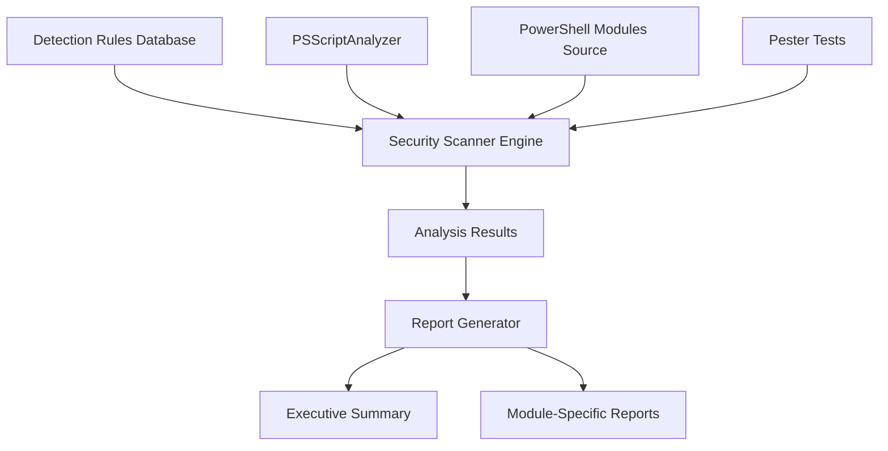
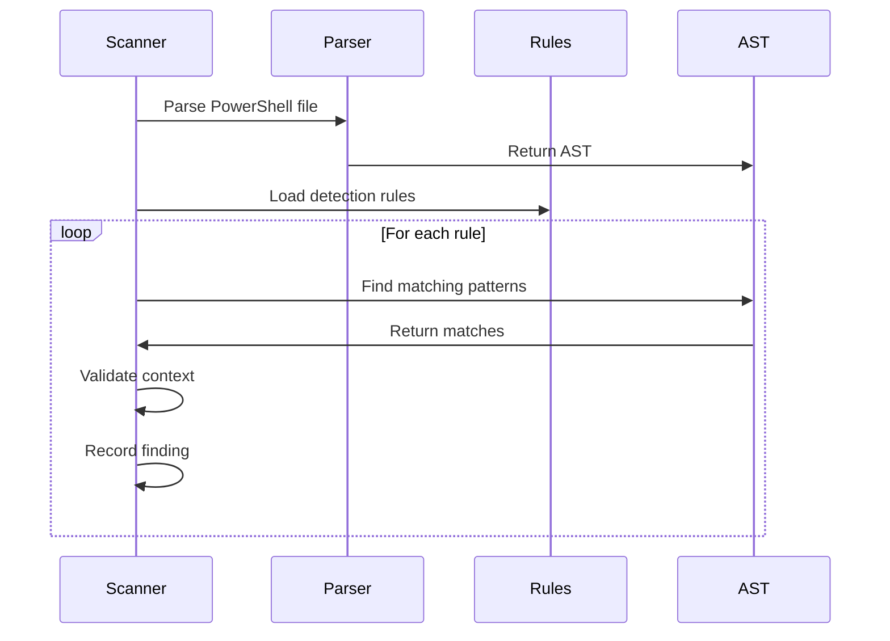
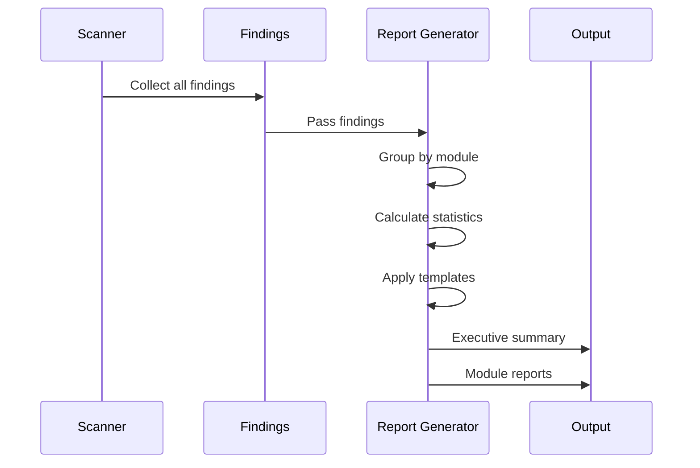
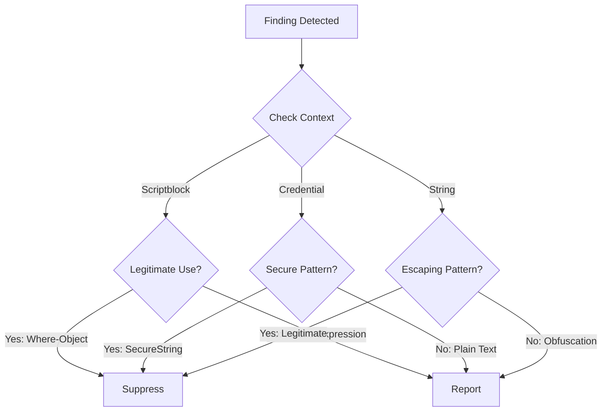

# System Patterns: PowerShell Security Code Review Architecture

## System Architecture

### High-Level Architecture



### Component Overview

1. **Detection Rules Database**: Centralized rule definitions with severity, patterns, and remediation
2. **Security Scanner Engine**: Core analysis engine that applies rules to source code
3. **PSScriptAnalyzer Integration**: Leverages Microsoft's static analysis tool
4. **Report Generator**: Transforms analysis results into structured reports
5. **Pester Tests**: Validates scanner functionality and rule accuracy

## Key Technical Decisions

### Decision 1: Rule-Based Detection Pattern

**Context**: Need flexible, maintainable security detection system

**Decision**: Implement rule-based detection with structured rule definitions

**Rationale**:

- **Extensibility**: Easy to add new rules without code changes
- **Maintainability**: Rules are data, not hard-coded logic
- **Transparency**: Clear documentation of what each rule detects
- **Standardization**: Consistent rule format across all detections

**Implementation**:

```powershell
# Rule Structure
@{
    Id = 'PS001'
    Name = 'Invoke-Expression Usage'
    Severity = 'High'
    Category = 'CodeExecution'
    Description = 'Detects use of Invoke-Expression'
    ASTPattern = 'CommandAst'
    CommandName = 'Invoke-Expression'
    Remediation = 'Use & operator or dot-sourcing'
    CVSS = 7.3
}
```

### Decision 2: AST-Based Analysis

**Context**: Need accurate PowerShell code analysis

**Decision**: Use PowerShell Abstract Syntax Tree (AST) for code parsing

**Rationale**:

- **Accuracy**: Native PowerShell parser understands language syntax
- **Reliability**: No false positives from regex-based string matching
- **Depth**: Can analyze code structure, not just text patterns
- **Performance**: Efficient parsing of complex PowerShell scripts

**Implementation**:

- Use `[System.Management.Automation.Language.Parser]::ParseFile()`
- Navigate AST nodes to find specific patterns
- Extract precise line numbers and code context

### Decision 3: Context-Aware Filtering

**Context**: PowerShell has legitimate patterns that look suspicious

**Decision**: Implement context-aware analysis with PowerShell-specific understanding

**Rationale**:

- **Reduce False Positives**: Understand legitimate PowerShell idioms
- **Accuracy**: Distinguish between dangerous and safe usage patterns
- **Developer Experience**: Avoid overwhelming with irrelevant warnings

**Implementation**:

- Scriptblock usage: Analyze caller context (Where-Object vs Invoke-Expression)
- Credential handling: Check for secure patterns (SecureString, PSCredential)
- String escaping: Recognize legitimate escape sequences
- Configuration context: Understand infrastructure code patterns

### Decision 4: Severity Classification with CVSS

**Context**: Need consistent risk assessment across findings

**Decision**: Use CVSS (Common Vulnerability Scoring System) scores

**Rationale**:

- **Industry Standard**: Widely recognized vulnerability scoring system
- **Quantifiable**: Objective risk measurement
- **Prioritization**: Enables risk-based remediation planning
- **Communication**: Common language for security discussions

**Severity Mapping**:

- **Critical**: CVSS 9.0-10.0 (Immediate action required)
- **High**: CVSS 7.0-8.9 (Urgent remediation)
- **Medium**: CVSS 4.0-6.9 (Scheduled remediation)
- **Low**: CVSS 0.1-3.9 (Best practice improvement)
- **Info**: CVSS 0.0 (Informational only)

### Decision 5: Layered Scanning Approach

**Context**: Multiple detection mechanisms needed for comprehensive coverage

**Decision**: Implement layered scanning with multiple engines

**Rationale**:

- **Completeness**: Different tools find different issues
- **Validation**: Cross-validation between tools increases confidence
- **Leverage Existing**: Use proven tools (PSScriptAnalyzer) alongside custom rules

**Layers**:

1. **PSScriptAnalyzer**: Microsoft's built-in rules
2. **Custom AST Rules**: Project-specific detection patterns
3. **Pattern Matching**: Regex-based detection for specific strings
4. **Pester Tests**: Validation of scanner behavior

## Design Patterns in Use

### Pattern 1: Strategy Pattern (Rule Execution)

**Purpose**: Different detection strategies for different rule types

**Implementation**:

- Each rule type has a specific execution strategy
- CommandAst rules: Find command invocations
- StringConstantExpressionAst rules: Find string literals
- VariableExpressionAst rules: Find variable usage

### Pattern 2: Builder Pattern (Report Generation)

**Purpose**: Construct complex reports incrementally

**Implementation**:

```powershell
# Report builder accumulates findings
$reportBuilder = New-SecurityReportBuilder
$reportBuilder.AddFinding($finding1)
$reportBuilder.AddFinding($finding2)
$report = $reportBuilder.Build()
```

### Pattern 3: Repository Pattern (Rule Storage)

**Purpose**: Abstract rule storage and retrieval

**Implementation**:

- Rules stored in structured format (PowerShell data file)
- Repository provides query interface
- Separation of rule definition from rule execution

### Pattern 4: Template Method Pattern (Scanning Workflow)

**Purpose**: Define standard scanning workflow with customizable steps

**Implementation**:

```powershell
function Invoke-SecurityScan {
    # Template method defines workflow
    Initialize-Scanner
    $rules = Load-Rules
    $files = Get-FilesToScan
    foreach ($file in $files) {
        $findings += Apply-Rules -File $file -Rules $rules
    }
    Generate-Report -Findings $findings
}
```

## Component Relationships

### Detection Rules → Scanner Engine

- Scanner loads rules from rule repository
- Rules define what patterns to detect
- Scanner applies rules to AST nodes

### Scanner Engine → PSScriptAnalyzer

- Scanner invokes PSScriptAnalyzer for built-in rules
- Results merged with custom rule findings
- Consistent severity classification applied

### Scanner Engine → Report Generator

- Scanner provides structured findings
- Report generator formats for different audiences
- Multiple output formats supported

### Pester Tests → Scanner Engine

- Tests validate rule accuracy
- Tests ensure no regressions
- Tests verify context-aware filtering

## Critical Implementation Paths

### Path 1: File Analysis



### Path 2: Report Generation



### Path 3: Context Validation



## Data Flow Architecture

### Input Flow

1. **Source Code**: PowerShell modules in `source/` directory
2. **Detection Rules**: Structured rule definitions
3. **PSScriptAnalyzer Config**: Built-in rule configuration

### Processing Flow

1. **Parse**: Convert PowerShell to AST
2. **Analyze**: Apply detection rules to AST
3. **Filter**: Apply context-aware filtering
4. **Score**: Calculate CVSS scores
5. **Aggregate**: Collect findings by module

### Output Flow

1. **Executive Summary**: High-level statistics and critical findings
2. **Module Reports**: Detailed findings per module
3. **Remediation Guide**: Specific fix recommendations
4. **Metrics**: Security posture metrics

## Scalability Considerations

### Performance Optimization

- **Parallel Processing**: Process multiple files concurrently
- **Incremental Analysis**: Analyze only changed files when possible
- **Caching**: Cache AST parsing results for repeated analysis
- **Rule Optimization**: Optimize rule execution order (fast rules first)

### Extensibility

- **Plugin Architecture**: New rules can be added without code changes
- **Custom Analyzers**: Support for project-specific analyzers
- **Report Templates**: Customizable report formats
- **Integration Points**: API for external tool integration

## Security Considerations

### Scanner Security

- **Sandboxing**: Scanner runs in isolated context
- **Input Validation**: Validate all rule inputs
- **Resource Limits**: Prevent resource exhaustion attacks
- **Safe Execution**: No execution of analyzed code

### Data Protection

- **Finding Storage**: Secure storage of sensitive findings
- **Report Access**: Access control for generated reports
- **Credential Handling**: Never log or expose credentials
- **Audit Trail**: Log all scanner executions

## Error Handling Strategy

### Error Categories

1. **Parse Errors**: PowerShell syntax errors in source files
2. **Rule Errors**: Malformed or invalid rules
3. **Resource Errors**: File access, memory, or I/O issues
4. **Analysis Errors**: Unexpected patterns or edge cases

### Recovery Approach

- **Graceful Degradation**: Continue analysis despite individual file failures
- **Error Reporting**: Document all errors in separate error log
- **Validation**: Pre-validate rules before execution
- **Fallback**: Use alternative detection methods when primary fails

## Quality Assurance

### Testing Strategy

- **Unit Tests**: Test individual rule detection accuracy
- **Integration Tests**: Test scanner with real-world modules
- **Regression Tests**: Prevent false positive regressions
- **Performance Tests**: Ensure acceptable scan times

### Validation Criteria

- **Accuracy**: >90% true positive rate
- **Coverage**: All defined rules functioning correctly
- **Performance**: <1 second per 1000 lines of code
- **Reliability**: Zero crashes or unhandled exceptions
