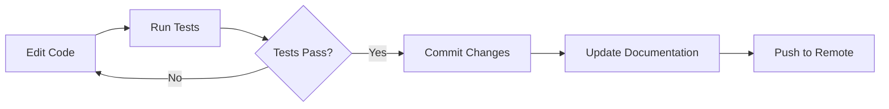

# Technical Context: PowerShell Security Code Review System

## Technologies Used

### Primary Technologies

#### PowerShell 5.1+

- **Purpose**: Primary language for scanning scripts and target modules
- **Version**: 5.1 or higher (Windows PowerShell compatibility)
- **Key Features Used**:
  - Abstract Syntax Tree (AST) parsing
  - Advanced functions with CmdletBinding
  - PowerShell modules and manifests
  - Pipeline processing
  - Error handling with try-catch

#### PSScriptAnalyzer

- **Purpose**: Static code analysis for PowerShell
- **Version**: Latest stable version
- **Key Features**:
  - Built-in security rules
  - Custom rule support
  - AST-based analysis
  - Configurable rule sets
- **Integration**: Invoked programmatically via `Invoke-ScriptAnalyzer`

#### Pester

- **Purpose**: Testing framework for PowerShell
- **Version**: 5.x
- **Key Features**:
  - Unit testing
  - Integration testing
  - Code coverage analysis
  - Mocking capabilities
- **Usage**: Validate scanner behavior and rule accuracy

### Test Modules

#### BadCodeExamples.psm1

- **Purpose**: Validation test module containing intentional security vulnerabilities
- **Location**: `source/BadCodeExamples.psm1`
- **Coverage**: All original 25 security rules with code examples triggering each rule
- **Usage**: Proves scanner detection capabilities (baseline testing for v1.0.0)
- **Results**: 92% rule trigger rate (23/25 rules successfully detected)
- **Findings**: 102 security issues correctly identified
- **Categories Covered**:
  - Code execution vulnerabilities (Invoke-Expression, Add-Type, Start-Process)
  - Credential management issues (hardcoded secrets, plaintext conversion, logging)
  - Cryptography weaknesses (MD5, SHA1, DES, RC2)
  - Network security (unencrypted auth, cert bypass, HTTP)
  - Windows security (disabled features, registry persistence)
  - Best practices (CmdletBinding, approved verbs, error handling)
- **Note**: Test module validates v1.0.0 baseline. New v1.1.0 rules (PS041-PS060) validated through pattern matching engine

### Supporting Technologies

#### Git

- **Purpose**: Version control and collaboration
- **Features Used**: Branching, commit tracking, collaboration

#### Visual Studio Code

- **Purpose**: Development environment
- **Extensions**: PowerShell extension for syntax highlighting and debugging

#### Markdown

- **Purpose**: Documentation format
- **Usage**: Memory Bank, README files, reports

## Development Setup

### Prerequisites

```powershell
# PowerShell version check
$PSVersionTable.PSVersion  # Should be 5.1 or higher

# Required modules
Install-Module -Name PSScriptAnalyzer -Scope CurrentUser -Force
Install-Module -Name Pester -MinimumVersion 5.0 -Scope CurrentUser -Force

# Optional but recommended
Install-Module -Name platyPS -Scope CurrentUser  # For help documentation
```

### Environment Configuration

#### PowerShell Execution Policy

```powershell
# Set execution policy to allow script execution
Set-ExecutionPolicy -ExecutionPolicy RemoteSigned -Scope CurrentUser
```

#### Module Path Setup

```powershell
# Ensure source modules can be loaded for analysis
$env:PSModulePath += ";$PWD\source"
```

### Project Structure

```
d:/Git/ai1/
├── memory-bank/              # Project documentation and context
│   ├── projectbrief.md
│   ├── productContext.md
│   ├── systemPatterns.md
│   ├── techContext.md
│   ├── activeContext.md
│   ├── progress.md
│   └── promptHistory.md
├── source/                   # PowerShell modules to be analyzed
│   └── datum/
│       └── 0.40.1/
│           ├── datum.psd1
│           ├── datum.psm1
│           ├── en-US/
│           └── ScriptsToProcess/
├── scanner/                  # Security scanning scripts (to be created)
│   ├── rules/               # Detection rule definitions
│   ├── Invoke-SecurityScan.ps1
│   └── Get-SecurityFindings.ps1
├── tests/                    # Pester test files (to be created)
│   ├── SecurityScanner.Tests.ps1
│   └── Rules.Tests.ps1
├── Report/                   # Generated security reports (to be created)
│   ├── ExecutiveSummary.md
│   └── datum-SecurityReport.md
└── README.md                 # Project overview (to be created)
```

## Technical Constraints

### Platform Constraints

#### Windows PowerShell Compatibility

- **Constraint**: Must support Windows PowerShell 5.1
- **Impact**: Cannot use PowerShell 7+ exclusive features
- **Mitigation**: Test on both Windows PowerShell and PowerShell 7+

#### File System Access

- **Constraint**: Requires read access to source directory
- **Impact**: Cannot analyze files without proper permissions
- **Mitigation**: Validate file access before analysis, document requirements

#### Memory Limitations

- **Constraint**: Large AST trees consume significant memory
- **Impact**: May need to process files individually for large modules
- **Mitigation**: Implement streaming/chunked processing if needed

### Language Constraints

#### PowerShell AST Complexity

- **Constraint**: Complex scripts may have deeply nested AST structures
- **Impact**: Rule matching complexity increases with nesting
- **Mitigation**: Implement recursive AST traversal with depth limits

#### Dynamic Code Analysis

- **Constraint**: Static analysis cannot detect runtime-only issues
- **Impact**: Some vulnerabilities may not be detected
- **Mitigation**: Document limitations, recommend complementary dynamic analysis

#### Obfuscation Detection

- **Constraint**: Sophisticated obfuscation may evade pattern detection
- **Impact**: False negatives for highly obfuscated malicious code
- **Mitigation**: Use multiple detection techniques, document detection limits

### Tool Constraints

#### PSScriptAnalyzer Coverage

- **Constraint**: Built-in rules may not cover all security scenarios
- **Impact**: Need custom rules for comprehensive coverage
- **Mitigation**: Implement custom rule engine alongside PSScriptAnalyzer

#### Pester Test Scope

- **Constraint**: Cannot test all possible code variations
- **Impact**: Some edge cases may not be covered
- **Mitigation**: Use representative test cases, document coverage gaps

## Dependencies

### Direct Dependencies

```powershell
@{
    # Core dependencies
    'PSScriptAnalyzer' = @{
        Version = 'latest'
        Purpose = 'Static code analysis'
        Source = 'PSGallery'
    }
    
    'Pester' = @{
        Version = '5.x'
        Purpose = 'Testing framework'
        Source = 'PSGallery'
    }
}
```

### Development Dependencies

```powershell
@{
    # Optional development tools
    'platyPS' = @{
        Version = 'latest'
        Purpose = 'Help documentation generation'
        Source = 'PSGallery'
        Optional = $true
    }
    
    'PSake' = @{
        Version = 'latest'
        Purpose = 'Build automation'
        Source = 'PSGallery'
        Optional = $true
    }
}
```

### System Dependencies

- **Windows PowerShell 5.1** or **PowerShell 7+**
- **.NET Framework 4.7.2+** (for Windows PowerShell)
- **Git** (for version control)
- **Visual Studio Code** (recommended IDE)

## Development Workflow

### Local Development



### Testing Workflow

```powershell
# Run all tests
Invoke-Pester -Path ./tests -Output Detailed

# Run specific test file
Invoke-Pester -Path ./tests/SecurityScanner.Tests.ps1

# Run with code coverage
Invoke-Pester -Path ./tests -CodeCoverage ./scanner/*.ps1
```

### Code Analysis Workflow

```powershell
# Analyze scanner scripts themselves
Invoke-ScriptAnalyzer -Path ./scanner -Recurse

# Analyze with specific rules
Invoke-ScriptAnalyzer -Path ./scanner -CustomRulePath ./rules
```

## Performance Considerations

### AST Parsing Performance

- **Bottleneck**: Large PowerShell files take time to parse
- **Optimization**: Cache parsed AST for repeated analysis
- **Benchmark**: ~50ms per 1000 lines of code

### Rule Execution Performance

- **Bottleneck**: Complex regex patterns in rules
- **Optimization**: Pre-compile regex patterns, optimize rule order
- **Benchmark**: Target <1 second per file for typical modules

### Report Generation Performance

- **Bottleneck**: Large finding sets require formatting
- **Optimization**: Stream output, use StringBuilder for concatenation
- **Benchmark**: <100ms for typical report generation

## Security Considerations

### Security Detection Rules Architecture (v1.1.0)

#### Rule Statistics

- **Total Rules**: 45 (increased from 25 in v1.0.0)
- **Severity Distribution**: 11 Critical, 13 High, 11 Medium, 6 Low, 4 Info
- **CVSS Range**: 0.0 (informational) to 9.8 (critical)
- **New Rules (v1.1.0)**: PS041-PS060 (20 rules)

#### v1.1.0 Rule Categories

**Defense Evasion (4 rules)**:
- PS044: Script Block Logging Disabled (CVSS 9.0)
- PS045: AMSI Bypass Attempt (CVSS 9.8)
- PS046: Constrained Language Mode Bypass (CVSS 9.5)
- PS047: Execution Policy Bypass (CVSS 5.5)

**Code Execution (6 rules)**:
- PS041: .NET Reflection Assembly Loading (CVSS 7.8)
- PS042: COM Object Creation (CVSS 6.5)
- PS043: WMI/CIM Command Execution (CVSS 7.5)
- PS049: Reflective DLL Injection (CVSS 9.0)
- PS050: Process Injection Techniques (CVSS 9.3)
- PS055: LOLBins Abuse (CVSS 6.5)

**Credential Theft (2 rules)**:
- PS052: Kerberos Ticket Manipulation (CVSS 9.0)
- PS054: Token Manipulation (CVSS 8.0)

**Network & Exfiltration (3 rules)**:
- PS051: Suspicious Web Request (CVSS 6.0)
- PS056: PowerShell Remoting (CVSS 6.0)
- PS060: DNS Tunneling (CVSS 7.0)

**Data Exfiltration (2 rules)**:
- PS058: Clipboard Access (CVSS 3.5)
- PS059: Screen Capture (CVSS 5.5)

**Anti-Forensics (1 rule)**:
- PS053: Event Log Manipulation (CVSS 7.5)

**Privilege Escalation (2 rules)**:
- PS057: UAC Bypass Techniques (CVSS 7.5)
- PS048: Suspicious Encoded Command (CVSS 7.8)

#### Context Analysis Intelligence

**6 Rules with Advanced Context Filtering**:
1. **PS041** - Distinguishes safe assembly names from byte array loading
2. **PS042** - Whitelists Office COM objects, flags WScript.Shell
3. **PS051** - Whitelists trusted domains (GitHub, Microsoft), flags IPs
4. **PS056** - Downgrades normal remoting to Info, escalates obfuscation
5. **PS058** - Downgrades clipboard access to Info (automation)
6. **PS060** - Downgrades DNS lookups to Info unless loops/encoding detected

**14 Rules with Pattern Matching Only**:
- Critical threats that should always be flagged (AMSI bypass, CLM bypass, injection techniques)
- No false positive risk - any detection is legitimate security concern

#### Threat Intelligence Sources

- **Microsoft Learn**: PowerShell security features, AMSI integration, CLM enforcement
- **OWASP**: Injection prevention, secure coding practices
- **MITRE ATT&CK**: T1059.001 PowerShell technique taxonomy
- **Research Date**: November 2025

### Scanner Isolation

- **Requirement**: Scanner must not execute analyzed code
- **Implementation**: AST parsing only, no `Invoke-Expression` or script execution
- **Validation**: Pester tests verify no code execution occurs

### Credential Handling

- **Requirement**: Never log or expose credentials found in code
- **Implementation**: Redact sensitive data in reports, use placeholders
- **Validation**: Test reports for credential leakage

### Input Validation

- **Requirement**: Validate all file paths and rule inputs
- **Implementation**: Use `Test-Path`, validate rule schema
- **Validation**: Test with malformed inputs

## Tool Usage Patterns

### PSScriptAnalyzer Integration

```powershell
# Basic invocation
$results = Invoke-ScriptAnalyzer -Path $filePath

# With custom rules
$results = Invoke-ScriptAnalyzer `
    -Path $filePath `
    -CustomRulePath ./scanner/rules `
    -Severity @('Error', 'Warning')

# Filter results
$securityFindings = $results | Where-Object {
    $_.RuleName -like '*Security*'
}
```

### AST Parsing Pattern

```powershell
# Parse PowerShell file
$ast = [System.Management.Automation.Language.Parser]::ParseFile(
    $filePath,
    [ref]$tokens,
    [ref]$errors
)

# Find specific AST node types
$commandAsts = $ast.FindAll({
    param($node)
    $node -is [System.Management.Automation.Language.CommandAst]
}, $true)

# Extract line numbers and code
foreach ($cmdAst in $commandAsts) {
    $lineNumber = $cmdAst.Extent.StartLineNumber
    $code = $cmdAst.Extent.Text
}
```

### Pester Testing Pattern

```powershell
Describe 'Security Scanner' {
    BeforeAll {
        # Setup test environment
        $testModule = Join-Path $TestDrive 'TestModule.psm1'
        Set-Content -Path $testModule -Value 'Invoke-Expression $userInput'
    }
    
    Context 'When detecting Invoke-Expression usage' {
        It 'Should find Invoke-Expression command' {
            $findings = Invoke-SecurityScan -Path $testModule
            $findings | Should -Not -BeNullOrEmpty
            $findings[0].RuleName | Should -Be 'Invoke-Expression Usage'
        }
    }
}
```

## Build and Deployment

### Build Process (Future Enhancement)

```powershell
# Build script structure (not yet implemented)
# 1. Validate scanner scripts with PSScriptAnalyzer
# 2. Run all Pester tests
# 3. Generate documentation with platyPS
# 4. Package scanner for distribution
```

### Deployment Considerations

- **Distribution**: Scanner scripts can be copied to any Windows system
- **Installation**: No installation required, just PowerShell modules
- **Updates**: Git pull for latest rules and scanner updates
- **Portability**: Pure PowerShell, no external dependencies beyond PSGallery modules

## Future Technical Enhancements

### Potential Improvements

1. **Parallel Processing**: Use `ForEach-Object -Parallel` (PowerShell 7+) for faster scanning
2. **Custom Rule DSL**: Domain-specific language for easier rule creation
3. **Integration APIs**: REST API for CI/CD pipeline integration
4. **Machine Learning**: ML-based obfuscation detection
5. **Real-time Analysis**: File watcher for continuous security monitoring

### Technology Evolution

- **PowerShell 7+ Migration**: Leverage cross-platform capabilities
- **Container Support**: Docker-based scanner for consistent environments
- **Cloud Integration**: Azure DevOps pipeline tasks, GitHub Actions
- **Dashboard**: Web-based dashboard for report visualization
